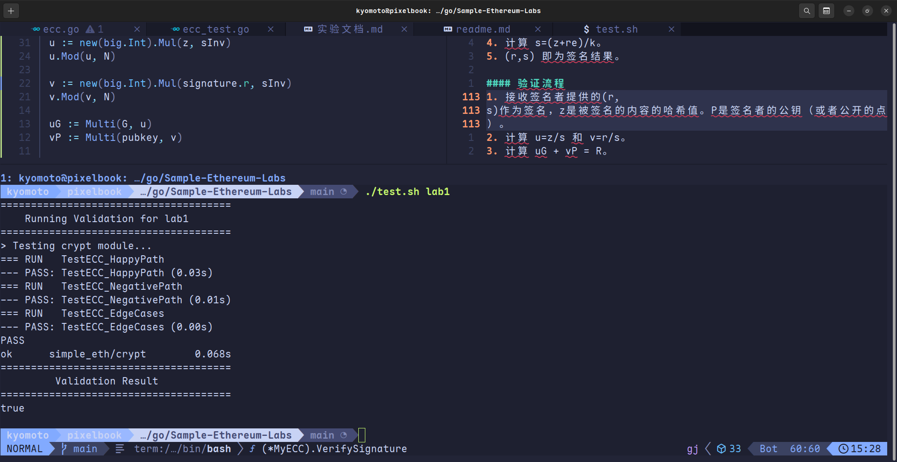

# Lab1 Report
## 测试结果


## 代码思路
### `Sign签名`
1. 根据消息`msg`生成哈希签名`z`
2. 调用`NewPrivateKey`生成随机数`k`
3. 计算`R=kG`以及x轴坐标`r`，并对`r`的合法性进行检查(不能为0)
4. 计算 `s=(z+re)/k`, 同理对`s`的合法性进行检查(不能为0)
5. 若上述两个合法性未通过则再次尝试生成直至合法
6. 封装为`Signature`返回给上层
```go
func (ecc *MyECC) Sign(msg []byte, secKey *big.Int) (*Signature, error) {
	// TODO: Lab 1, calculate coordinates (r,s) with private key to construct ECDSA signature.
	z := hashMessage(msg)
	for {
		k, err := NewPrivateKey()
		if err != nil {
			return nil, err
		}

		R := Multi(G, k)
		r := new(big.Int).Mod(R.X, N)
		if r.Sign() == 0 {
			continue
		}

		kInv := Inv(k, N)
		re := new(big.Int).Mul(r, secKey)
		s := new(big.Int).Add(z, re)
		s.Mul(s, kInv)
		s.Mod(s, N)

		if s.Sign() == 0 {
			continue
		}

		halfN := new(big.Int).Div(N, big.NewInt(2))
		if s.Cmp(halfN) == 1 {
			s.Sub(N, s) // NOTE: ensure identity
		}

		return &Signature{s: s, r: r}, nil
	}

}
```
### `VerifySignature`验证签名
1. 根据接收到的`msg`生成哈希签名`z`
2. 对传入的`Sign`进行合法性验证（不为0才合法）
3. 计算`u=z/s,v=r/s`
4. 计算`uG+vP=R`
5. 如果`R`的x坐标等于r则签名有效
```go
func (ecc *MyECC) VerifySignature(msg []byte, signature *Signature, pubkey *Point) bool {
	// TODO: Lab 1, verify signature authenticity by inferring uG + vP = R with public key.
	z := hashMessage(msg)

	if signature.s.Sign() == 0 {
		return false
	}

	sInv := Inv(signature.s, N)

	u := new(big.Int).Mul(z, sInv)
	u.Mod(u, N)

	v := new(big.Int).Mul(signature.r, sInv)
	v.Mod(v, N)

	uG := Multi(G, u)
	vP := Multi(pubkey, v)

	R := Add(uG, vP)

	return R.X.Cmp(signature.r) == 0
}
```
